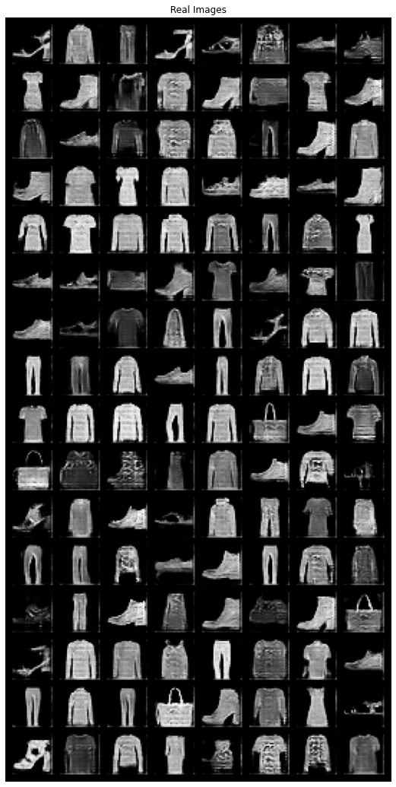
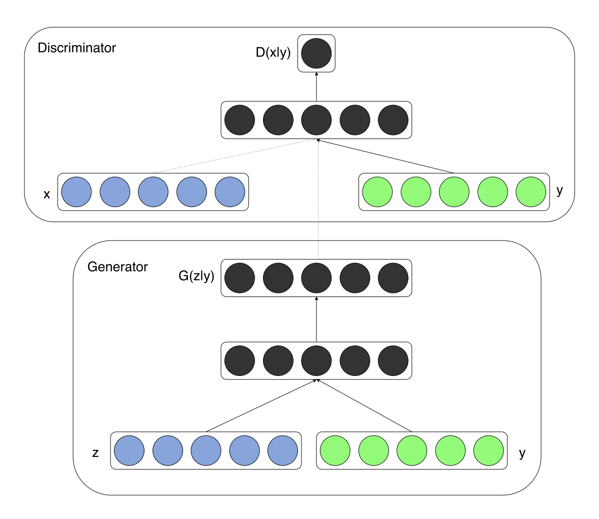
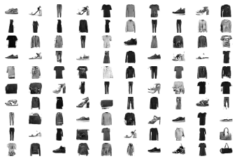

### 生成对抗网络实验

### 1. DCGAN

#### 实验目标：

数据集：FashionMNIST

模型：DCGAN

#### 注意事项：

* 刚开始写gan，会发现训练不动，没有迭代一个epoch就会发现生成器损失下降不下去，判别器损失为0，标志着训练失败。
* 一些训练的trick可以尝试，参考：https://github.com/soumith/ganhacks。比如使用BN、替换relu为LeakyReLU等等。

#### 实验结果：

只跑了5个epoch，可以看到效果比较好。但还是会发现有很多重复相似的图片。实验结果如下图（（打错了，应该是”Fake Images“））。

#### 对比实验

这里对比了自动编码器，我使用了全连接的自动编码器，效果不是很好。还可以试试全卷积的。

### 2.Conditional GAN

DCGAN已经验证了生成对抗网络具有生成真实图片的能力，但如何生成指定类别的图片？条件gan给出了答案，通过训练生成器与判别器时加入对应类别的label就可以生成指定类别的图片。

在模型中，类别label用不同数字表示，经过embedding层后reshape为与图像一样大小作为其另一个通道。

#### 实验结果

